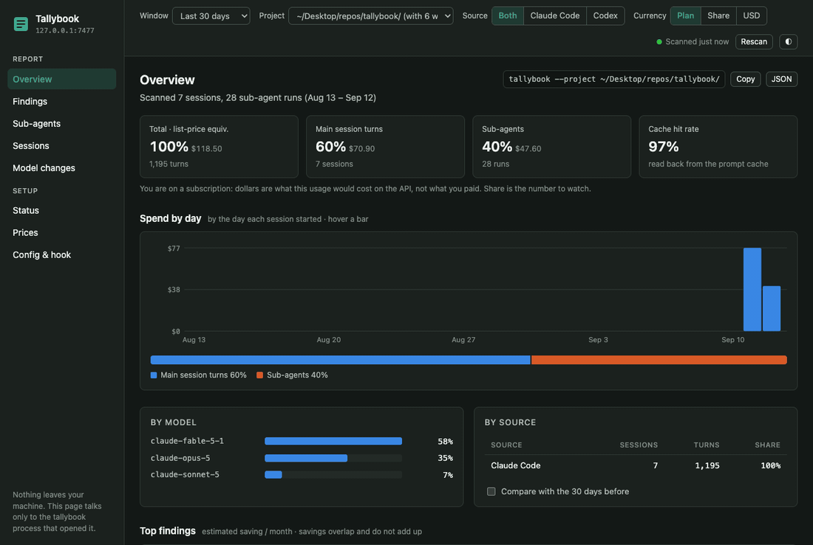
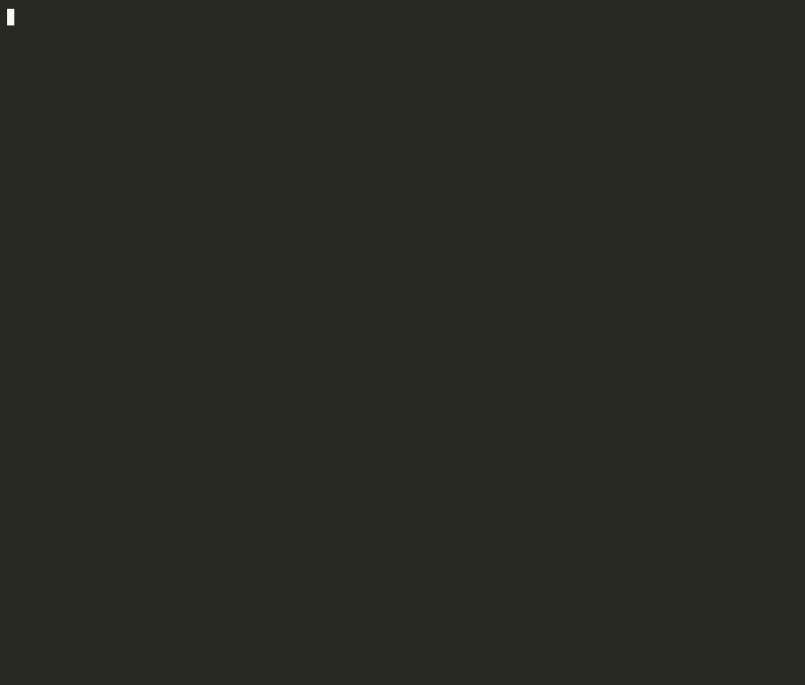

<div align="center">
  
  <h1>Tallybook</h1>
  <p><strong>Prices every Claude Code and Codex session on your disk, shows what each agent cost over any period, and tells you in plain English what would have been cheaper.</strong></p>
  <p>
    <a href="https://github.com/magna-nz/tallybook/actions/workflows/ci.yml"></a>
    <a href="https://github.com/magna-nz/tallybook/releases/latest"></a>
    <a href="https://modelcontextprotocol.io/"></a>
    <a href="LICENSE"></a>
    <a href="https://glama.ai/mcp/servers/magna-nz/tallybook"></a>
    <a href="https://mcpservers.org/servers/magna-nz/tallybook"></a>
  </p>
  <p><a href="https://magna-nz.github.io/tallybook/">Documentation</a></p>
</div>

<br />

No proxy, no API key, nothing leaves your machine. Run it as a CLI, open the same report in your
browser with `tallybook --serve`, or add `tallybook-mcp` to Claude Code or Codex and ask the agent
itself what it's spending and what would be cheaper.

<div align="center">
  
  <br />
  <sub><strong>In your browser</strong> · <code>tallybook --serve</code></sub>
  <br /><br />
  
  <br />
  <sub><strong>In your terminal</strong> · <code>tallybook</code></sub>
</div>

<br />

More in the [documentation](https://magna-nz.github.io/tallybook/).

## Install

```sh
brew install --cask magna-nz/tap/tallybook
```

Also available via `go install github.com/magna-nz/tallybook/cmd/tallybook@latest`, or as a
[release download](https://github.com/magna-nz/tallybook/releases/latest). Works on macOS, Linux
and Windows.

Add the MCP server so your agent can check its own spend mid-session — `tallybook-mcp` ships
alongside `tallybook`, so no separate install:

```sh
claude mcp add tallybook -- tallybook-mcp   # Claude Code
```

For Codex, add it to `~/.codex/config.toml`:

```toml
[mcp_servers.tallybook]
command = "tallybook-mcp"
```

## Use

```sh
tallybook                         # this period's report: the five biggest findings
tallybook --serve                 # the same report, findings and sessions in your browser, on localhost
tallybook findings                # every finding, grouped by what kind of change it asks for
tallybook --since 7d --compare    # this week against last week: spend, sessions, cache hit rate
tallybook finding 1               # finding #1 in full: what happened, why, what to change
tallybook finding 1 --evidence    # the same, with the sessions behind it
tallybook finding 1 --patch       # finding #1's fix, as an applyable diff
tallybook agents                  # spend by sub-agent type, with the model and effort each ran at
tallybook sessions --sort cost    # sessions ranked by what they cost
tallybook changes                 # did a past model swap actually save money?
tallybook setup hook              # record sessions automatically as they end
```

## Docs

The command reference, the MCP server's tools, configuration, and the privacy model live on the
**[documentation site](https://magna-nz.github.io/tallybook/)**.

## License

MIT
